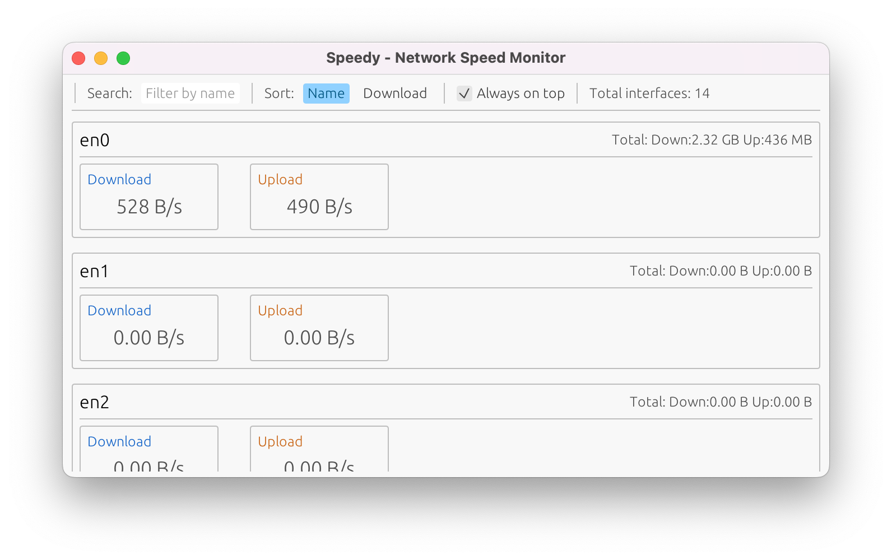

# Speedy - Network Speed Monitor

## Overview

Speedy is a network speed monitoring tool built with Rust and the egui framework. It can display the status and network transmission rates of all network interfaces in the system in real-time.

### Key Features

- **Real-time Monitoring**: Display download and upload speeds for all network interfaces
- **Interface List**: Show available network interfaces in the system
- **Speed Display**: Present network transmission rates in a readable format
- **Search Filter**: Support searching and filtering by interface name
- **Sorting Function**: Sort by name or download speed
- **Always on Top**: Support window always-on-top display for convenient real-time monitoring

## Screenshot



## Usage

### macOS

Download `speedy-macos.zip` from GitHub Actions artifacts, extract it, and double-click `Speedy.app` to run.

### Windows

Download `speedy-windows.exe` from GitHub Actions artifacts and double-click to run.

### Linux

Download the `speedy` executable from GitHub Actions artifacts and run it in the terminal.

## Technical Features

- **Cross-platform**: Supports macOS, Windows, and Linux
- **Lightweight**: Built with Rust for high performance
- **Native Interface**: Based on egui framework, providing native user experience
- **Dependency-free**: Single executable file, no additional installation required

## Build Instructions

### Build from Source

```bash
git clone https://github.com/zhangyuan/speedy
cd speedy
cargo build --release
```

### Platform-specific Builds

```bash
# macOS
cargo build --release

# Windows
cargo build --release --target x86_64-pc-windows-msvc

# Linux
cargo build --release
```

## Acknowledgement

This project utilizes AI for writing and development.

## License

MIT License
